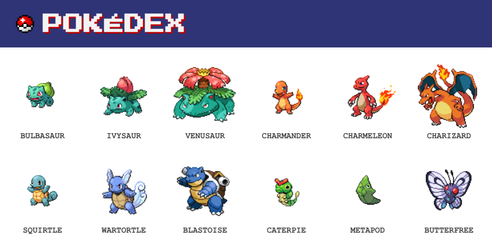

# Pokédex

A Simple pokedex that fetches data using async and ReactJS.

## `Game Link`

> > link goes here

### `Approach`

Create a main App page that links to other components of the page using using React Router.

### `Methods Used`

- ReactJs
- useState/useEffect
- Router/Route/Switch/Link

### `Technology Used`

- Macbook Pro
- ReactJS
- Node Modules
- Javascript
- HTML
- CSS
  - Flex display :muscle:

### `Future Goals`

- [ ] Add search bar
- [ ] Hovered pokemon turns shiny
- [ ] Battle simulator
- [ ] Dark mode

### `Conclusion`

Reached my goals to make a simple and easy to view clean web app. Will be adding more from `Future Goals` as the cohort goes.
